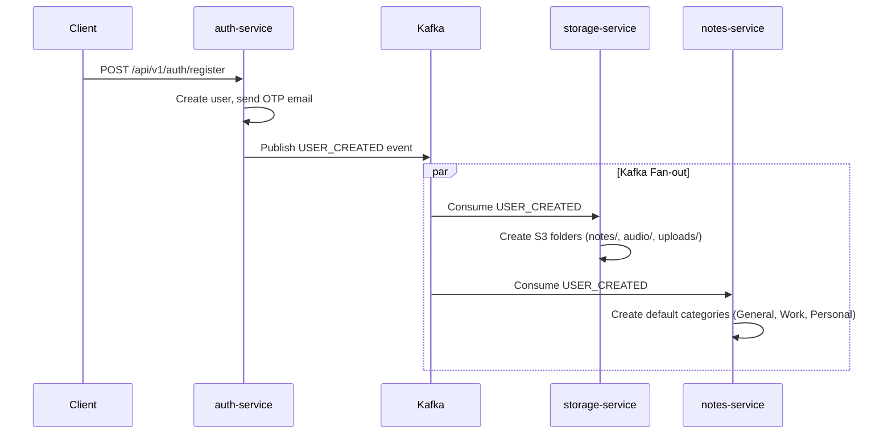

# Event Streaming with Kafka

OmniNet uses **Apache Kafka** in KRaft mode (no ZooKeeper) for asynchronous, decoupled event streaming between services.

## Event Topics

| Topic | Producer | Consumers | Purpose |
|-------|----------|-----------|---------|
| `omninet.user.created` | auth-service | storage-service, notes-service | Provision user folders in S3 and default note categories |
| `omninet.user.updated` | auth-service | storage-service | Propagate profile changes |
| `omninet.file.events` | storage-service | storage-service | Quota reconciliation on upload/delete |
| `omninet.note.events` | notes-service | — | Note change auditing |
| `omninet.todo.reminders` | notes-service | — | Todo reminder dispatch from scheduler |

## Event Flow — User Registration



## Event Schema — UserCreatedEvent

```java
public record UserCreatedEvent(
    String userId,
    String email,
    String firstName,
    String lastName,
    Instant createdAt
) {}
```

## Kafka Configuration

| Property | Value |
|----------|-------|
| Mode | KRaft (no ZooKeeper) |
| Compression | `none` (configurable via `KAFKA_COMPRESSION_TYPE`) |
| Bootstrap | `localhost:9092` (local) / `omninet-kafka:9092` (Docker) |
| Topic replication | 1 (development) |
| Consumer group prefix | `omninet-*` |

> [!NOTE]
> Kafka compression was set to `none` because Alpine Linux containers use musl libc, which is incompatible with Snappy's native JNI library.

## Producer Error Handling

All Kafka producers wrap publish calls in try-catch blocks to prevent Kafka failures from blocking the main request flow:

```java
try {
    kafkaTemplate.send(topic, event);
} catch (Exception e) {
    log.error("Failed to publish Kafka event: {}", e.getMessage());
    // Non-fatal — main operation already completed
}
```
