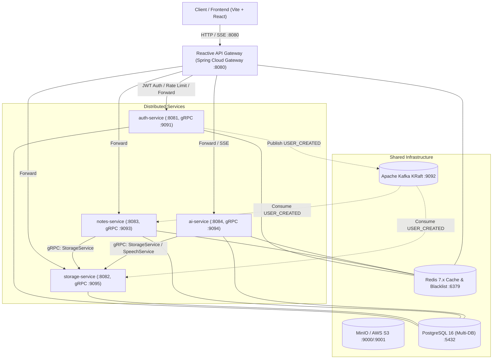

# System Architecture Overview

OmniNet follows a **microservices architecture** where each domain is an independently deployable service communicating via gRPC (synchronous RPC) and Apache Kafka (asynchronous events).

## High-Level Diagram



## Design Principles

### Database-per-Service
Each service owns its own **PostgreSQL database**. No direct cross-service DB queries are allowed. Data sharing happens through APIs or events.

| Service | Database |
|---------|----------|
| auth-service | `omninet_auth` |
| storage-service | `omninet_storage` |
| notes-service | `omninet_notes` |
| ai-service | `omninet_ai` |

### Single Entry Point
All client requests enter through the **API Gateway** at `:8080`. The gateway:
- Validates JWT tokens
- Enriches requests with `X-User-Id` and `X-User-Email` headers
- Applies Redis-backed rate limiting
- Routes to the correct downstream service

### Synchronous Communication — gRPC
Latency-sensitive operations (e.g., checking file existence before saving a note) use **gRPC** with Protobuf-defined contracts from the `omninet-proto` module.

### Asynchronous Communication — Kafka
Fire-and-forget events that fan out to multiple consumers use **Apache Kafka**:
- `USER_CREATED` → Storage provisions folders, Notes provisions categories
- `FILE_EVENTS` → Storage quota reconciliation
- `NOTE_EVENTS` → Note-change auditing
- `TODO_REMINDERS` → Scheduled reminder dispatch

## Security Model

```
Browser ──JWT──► API Gateway ──(strips external auth headers)──► Microservice
                      │
                      ├─ Validates JWT signature
                      ├─ Checks Redis token blacklist
                      ├─ Injects X-User-Id, X-User-Email
                      └─ Applies per-user rate limits
```

Downstream services trust `X-User-Id` / `X-User-Email` headers set by the gateway. They do **not** re-validate JWTs. The gateway is the single security enforcement point.
