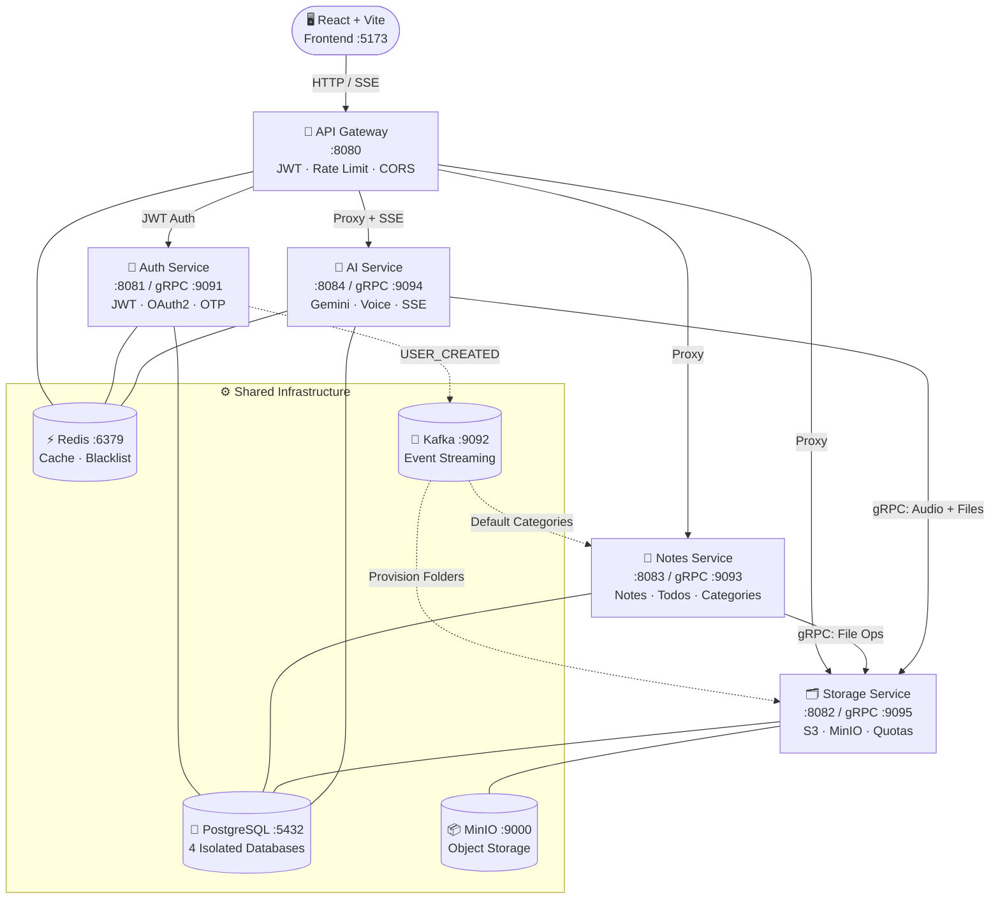
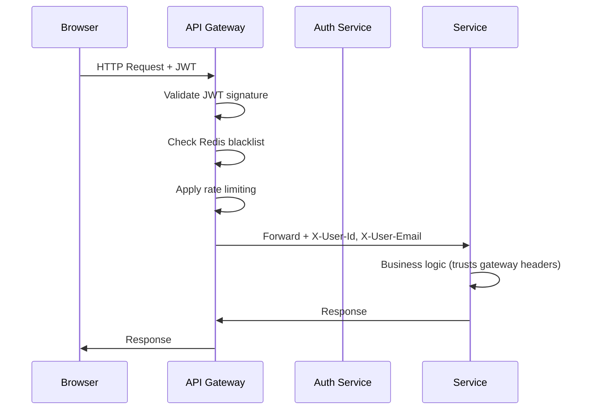
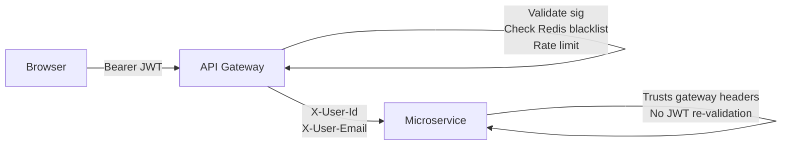

# System Architecture Overview

OmniNet follows a **microservices architecture** where each domain is independently deployable, communicating via **gRPC** (synchronous RPC) and **Apache Kafka** (asynchronous events).

---

## High-Level System Diagram

---

## Request Lifecycle

---

## Design Principles

### Database-per-Service

Each service owns its own **PostgreSQL database**. No direct cross-service DB queries — data sharing happens through APIs or Kafka events.

| Service | Database |
|---------|----------|
| auth-service | `omninet_auth` |
| storage-service | `omninet_storage` |
| notes-service | `omninet_notes` |
| ai-service | `omninet_ai` |

### Single Entry Point

All client requests enter through the **API Gateway** at `:8080`. The gateway validates JWTs, enriches requests with `X-User-Id` and `X-User-Email` headers, applies Redis-backed rate limiting, and routes to the correct service.

### Synchronous Communication — gRPC

Latency-sensitive operations use **gRPC** with Protobuf-defined contracts from the `omninet-proto` module.

### Asynchronous Communication — Kafka

Fire-and-forget events that fan out to multiple consumers use **Apache Kafka**:
- `USER_CREATED` → Storage provisions folders, Notes provisions categories
- `FILE_EVENTS` → Storage quota reconciliation
- `NOTE_EVENTS` → Note-change auditing

## Security Model

> [!NOTE]
> Downstream services trust `X-User-Id` / `X-User-Email` headers set by the gateway. The gateway is the single security enforcement point.
