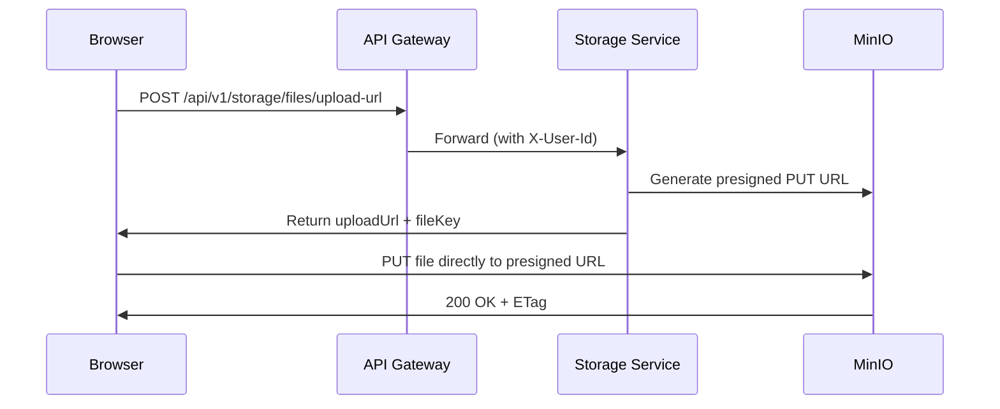

# Storage Service

**Port:** `8082` (HTTP) · `9095` (gRPC)  
**Database:** `omninet_storage`  
**Object Store:** MinIO (AWS S3-compatible)

The storage service manages all file operations, including uploads, downloads, folder management, presigned URLs, and per-user storage quotas.

## Features

- **Presigned URL Upload** — Generates S3 presigned PUT URLs for direct browser-to-MinIO upload (avoids proxying binary through the backend).
- **Presigned URL Download** — Generates presigned GET URLs with correct `Content-Type` and `Content-Disposition: inline` for in-browser preview.
- **Folder Hierarchy** — User-isolated folder trees (`users/{email}/notes/`, `users/{email}/audio/`, `users/{email}/uploads/`).
- **Auto-provisioning** — Folders are created automatically when a `USER_CREATED` Kafka event is received.
- **Quota Enforcement** — Per-user storage quotas tracked in PostgreSQL.
- **S3 Key Resolution** — Bare filenames are resolved to full S3 keys using prefix matching.
- **MIME Type Detection** — Content type is auto-detected from the file extension for correct browser rendering.
- **gRPC Service** — Exposes `StorageGrpcService` for internal file operations from notes-service and ai-service.

## REST API

| Method | Path | Description |
|--------|------|-------------|
| `GET` | `/api/v1/storage/contents` | List folder contents |
| `GET` | `/api/v1/storage/stats` | Get quota and usage |
| `POST` | `/api/v1/storage/files/upload-url` | Get presigned PUT URL |
| `GET` | `/api/v1/storage/files/download-url` | Get presigned GET URL |
| `DELETE` | `/api/v1/storage/files/{key}` | Delete a file |
| `POST` | `/api/v1/storage/folders` | Create a folder |

## Presigned URL Flow



## S3 Client Configuration

Two S3 clients are configured:

| Client | Endpoint | Purpose |
|--------|----------|---------|
| `s3Client` | `http://minio:9000` (internal) | Backend operations (exists, delete, gRPC) |
| `s3Presigner` | `http://localhost:9000` (public) | Presigned URL generation (browser-resolvable) |

> [!IMPORTANT]
> Using the internal Docker hostname (`minio`) for presigned URLs causes `ERR_NAME_NOT_RESOLVED` in the browser. Always use the public endpoint for presigned URL generation.

## gRPC Operations

Exposed via `StorageGrpcService` at `:9095`:

```
UploadFile(stream FileChunk) → UploadResponse
DownloadFile(FileRequest) → stream FileChunk
DeleteFile(FileRequest) → DeleteResponse
CheckFileExists(FileRequest) → ExistsResponse
CreateUserFolders(UserFolderRequest) → FolderResponse
```
