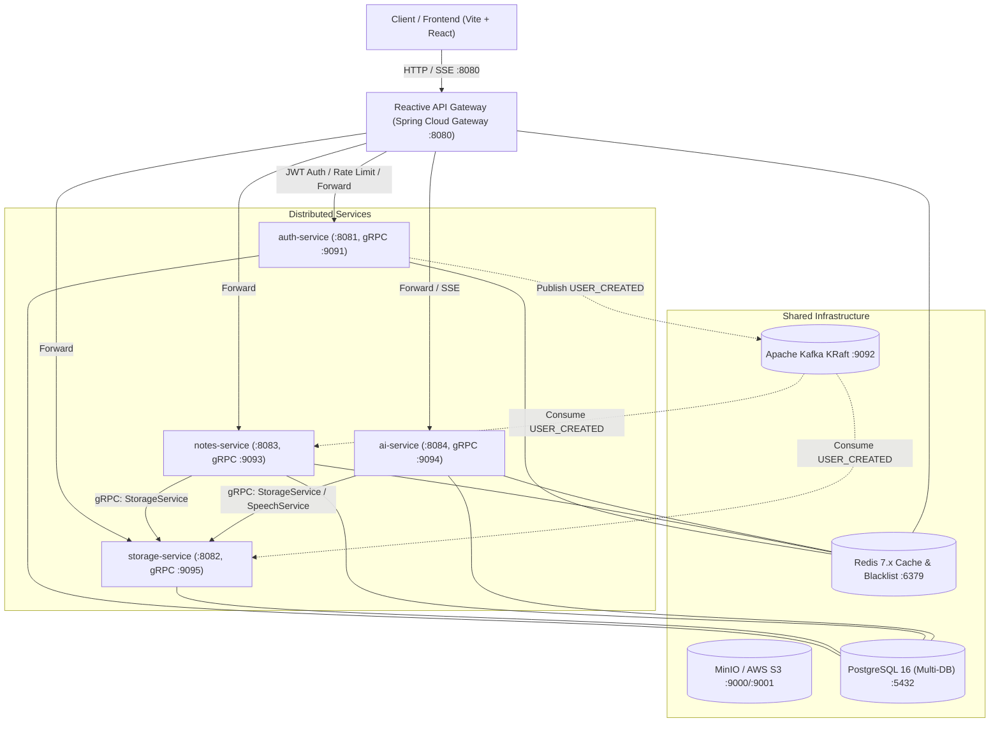

# Omninet Distributed Microservices — Migration Walkthrough

The legacy monolithic backend (`Omninet-Core`) has been migrated into an enterprise distributed microservices architecture while retaining **100% of the original business functionality**:
- **Authentication & OAuth2**: Google & GitHub OAuth2, multi-device JWT rotation, email OTP verification, and Redis-backed token blacklisting.
- **Notes & Categories**: Rich notes CRUD, categories, file attachments, 30-day recycle bin, duplicate, pin, favorite, and search.
- **Todo Tasks**: Todo management, status workflows, reminders, and daily background schedulers.
- **S3/MinIO Storage**: AWS S3 SDK v2 integration, presigned upload/download URLs, direct multi-part uploads, folder hierarchies, and user quotas.
- **AI Assistant**: Conversational AI (Gemini + Ollama providers), voice chat (STT/TTS via gRPC and fallback), session management, and SSE token streaming.
- **Distributed Coordination**: Inter-service **gRPC** calls, **Apache Kafka** event streaming, **Redis** distributed caching and rate-limiting, and independent **PostgreSQL** databases per service.

---

## 1. System Architecture



---

## 2. Module Inventory & Port Allocation

| Module | HTTP Port | gRPC Port | Database | Primary Role |
| :--- | :--- | :--- | :--- | :--- |
| **`omninet-proto`** | — | — | — | Protobuf definitions (`auth.proto`, `storage.proto`, `notes.proto`, `ai.proto`) and generated gRPC stubs |
| **`omninet-common`** | — | — | — | Shared DTOs (`ApiResponse`, `PageResponse`), security filters (`GatewayHeaders`, `GatewayAuthenticationFilter`), exception handlers, Kafka event definitions |
| **`api-gateway`** | **8080** | — | Redis | Reactive Spring Cloud Gateway; Netty; JWT validation; Redis token blacklist; Rate Limiting; CORS; Request header enrichment (`X-User-Id`, `X-User-Email`) |
| **`auth-service`** | **8081** | **9091** | `omninet_auth` | User registration (OTP flow), JWT issuing/refresh rotation, OAuth2 (Google/GitHub), `UserGrpcService`, Kafka event publishing (`USER_CREATED`) |
| **`storage-service`**| **8082** | **9095** | `omninet_storage`| S3/MinIO operations, presigned upload/download URLs, folder tree management, quota enforcement, `StorageGrpcService`, Kafka consumer |
| **`notes-service`**  | **8083** | **9093** | `omninet_notes`  | Notes CRUD, categories, todos, search, 30-day recycle bin, `StorageGrpcClient` for attachments, Kafka event publishing and consumption |
| **`ai-service`**     | **8084** | **9094** | `omninet_ai`     | Chat sessions, Gemini AI provider, Ollama provider, voice chat, SSE streaming, gRPC client for storage and speech |
| **`omninet-security-web`** | **5173** | — | — | Vite React SPA connecting to `http://localhost:8080` (API Gateway) |

---

## 3. Inter-Service Communication

### gRPC RPC Services (`omninet-proto`)
- **`UserServiceGrpc`** (`auth-service` :9091):
  - `GetUserById`, `GetUserByEmail`, `ValidateToken`, `UpdateUserQuota`
- **`StorageServiceGrpc`** (`storage-service` :9095):
  - `UploadFile`, `DownloadFile`, `DeleteFile`, `CheckFileExists`, `CreateUserFolders`
- **`NotesServiceGrpc`** (`notes-service` :9093):
  - `GetNoteById`, `ValidateNoteOwnership`, `GetNotesStats`
- **`SpeechServiceGrpc`** (`ai-service` / Python speech service :9094):
  - `SpeechToText`, `TextToSpeech`

### Kafka Event Streaming (`omninet-common`)
- **`omninet.user.created`**: Fired by `auth-service` on registration.
  - `storage-service` consumes to provision S3 folder hierarchy (`users/{email}/notes`, `users/{email}/audio`, `users/{email}/uploads`).
  - `notes-service` consumes to provision default user categories.
- **`omninet.user.updated`**: Fired on profile updates.
- **`omninet.file.events`**: Fired on upload/delete for storage audit and quota reconciliation.
- **`omninet.note.events`**: Fired on note changes.
- **`omninet.todo.reminders`**: Dispatched by `notes-service` scheduled background runner.

---

## 4. How to Run Locally

### Option A: Complete Local Stack via Docker Compose (Recommended)

1. **Configure Environment Variables**:
   ```bash
   cd /home/surendra/IdeaProjects/Omninet/omninet-microservices
   cp .env.example .env
   # Edit .env with your Google/GitHub OAuth credentials and Gemini API key (optional)
   ```

2. **Start Infrastructure & Microservices**:
   ```bash
   docker compose up --build -d
   ```

---

## 6. Docker Compose Verification & Troubleshooting Fixes

During container startup and runtime log inspection, several issues were identified and resolved:

1. **Storage gRPC Port Collision (`9092` -> `9095`)**:
   - `storage-service` gRPC server was initially mapped to port `9092`, which clashed with Apache Kafka broker (`9092:9092`).
   - Remapped to `9095` across code, configuration, `.env`, and Docker Compose definitions.
2. **Spring Security Basic Auth Challenge on API Gateway**:
   - `api-gateway` inadvertently pulled `spring-boot-starter-security` from `omninet-common`, prompting `401 Unauthorized (Basic Realm)` before JWT filters executed.
   - Added exclusion for `spring-boot-starter-security` in `api-gateway/pom.xml` and extended `OPEN_ENDPOINTS` in `JwtAuthenticationGatewayFilterFactory.java` to support public auth routes (`/api/v1/auth/refresh-token`, `/api/v1/auth/verify-otp`, `/api/v1/auth/logout`, etc.).
3. **Mail Health Indicator Actuator Failure**:
   - In `auth-service`, actuator health reported `DOWN` due to missing `SPRING_MAIL_*` credentials in `docker-compose.yml`.
   - Wired `SPRING_MAIL_*` environment variables in `docker-compose.yml` and configured `management.health.mail.enabled: false` to ensure external mail connectivity does not block application health.
4. **CleanupService Missing Transaction (`Executing an update/delete query`)**:
   - Added `@Modifying` and `@Transactional` to `PendingUserRepository` and `EmailVerificationRepository` delete queries and `@Transactional` to `CleanupService`.
5. **NoResourceFoundException in GlobalExceptionHandler**:
   - Added explicit `@ExceptionHandler(NoResourceFoundException.class)` returning standard HTTP 404 rather than unhandled 500.
6. **CORS Multiple Headers Fix (`http://127.0.0.1:5173, http://127.0.0.1:5173`)**:
   - Downstream services behind the API gateway must not configure their own CORS filter. Disabled CORS in `auth-service`'s `SecurityConfig.java` and added `DedupeResponseHeader=Access-Control-Allow-Origin Access-Control-Allow-Credentials, RETAIN_FIRST` to `api-gateway` default filters.
7. **Google OAuth2 "Error 400: invalid_request"**:
   - Root cause: Spring Security computed `{baseUrl}` using the internal Docker container name (`http://auth-service:8081/login/oauth2/code/google`), which Google policy rejects as an insecure non-public domain.
   - Configured `server.forward-headers-strategy: framework` and set `redirect-uri: http://localhost:8080/login/oauth2/code/{registrationId}` so Google receives the exact authorized gateway redirect URI.
   - Updated `OAuth2SuccessHandler` to supply both `access_token` and `refresh_token` parameters for `AuthCallbackPage.jsx`.
8. **Spring Cloud Gateway 4.3.0 Property Prefix & Storage 403 Forbidden**:
   - Root cause: In Spring Cloud Gateway 4.3.0 (Spring Cloud 2024.1 / Spring Boot 3.5.x), the property prefix for `default-filters` and `routes` is `spring.cloud.gateway.server.webflux`, not `spring.cloud.gateway`. Because `default-filters` was declared directly under `spring.cloud.gateway`, it was ignored, and `JwtAuthenticationGatewayFilterFactory` never ran on any routes.
   - As a result, requests were forwarded to `storage-service` without `X-User-Id` and `X-User-Email` headers, causing downstream security to reject unauthenticated requests with `403 Forbidden`.
   - Fixed by re-indenting `default-filters` and `routes` under `spring.cloud.gateway.server.webflux`.
9. **Missing WebSocket Gateway Route & Handler**:
   - Frontend SockJS STOMP chat client attempted to connect to `http://localhost:8080/ws/info`, returning `404 Not Found`.
   - Added `/ws/**` route forwarding to `ai-service` (`http://ai-service:8084`), added `spring-boot-starter-websocket` to `ai-service/pom.xml`, created `WebSocketConfig.java` with SockJS STOMP support at `/ws`, and added `/ws/**` to `OPEN_ENDPOINTS` and `permitAll()` in security configs.
10. **Kafka Snappy Native Library Error on Alpine Linux (`ld-linux-x86-64.so.2`)**:
    - Root cause: `KafkaProducerConfig` specified `COMPRESSION_TYPE_CONFIG = "snappy"`. Because the containers use `eclipse-temurin:21-jre-alpine` (musl libc), Snappy's native C library `libsnappyjava.so` threw `UnsatisfiedLinkError: Error loading shared library ld-linux-x86-64.so.2` when publishing `UserCreatedEvent` during OAuth login, throwing a 500 error on the OAuth callback URL.
    - Fixed by switching `COMPRESSION_TYPE_CONFIG` to `"none"` (configurable via `${KAFKA_COMPRESSION_TYPE:none}`) and adding try-catch guards in `UserEventProducer.java`.
11. **Auth Controller Fallback**:
    - `/api/auth/user` and `/api/users/me` only relied on `@AuthenticationPrincipal CustomUserDetails`, which failed when requests were forwarded through the gateway with stripped sensitive headers.
    - Added fallback to `GatewayHeaders.getUserId(request)` and `GatewayHeaders.getUserEmail(request)` in `/api/auth/user` and `/api/users/me`.
12. **File Upload Presigned URL (`http://minio:9000` ERR_NAME_NOT_RESOLVED)**:
    - Root cause: `storage-service` used `http://minio:9000` for both internal S3 operations and presigned URL generation. Because `minio` is an internal Docker container name, the user's browser could not resolve the host `minio`.
    - Fixed:
      - Configured `s3.public-endpoint: ${S3_PUBLIC_ENDPOINT:http://localhost:9000}` in `storage-service/src/main/resources/application.yml` and `docker-compose.yml`.
      - Configured `S3Config.java` so `s3Presigner` uses `publicEndpoint` (`http://localhost:9000`), matching browser host resolution and AWS SigV4 signatures, while `s3Client` retains `http://minio:9000` for internal communication.
    - Verification: PUT file upload to presigned URL returned `HTTP 200 OK` (ETag generated by MinIO).
13. **Todo Creation 500 (`Cannot deserialize value of type TodoStatus from Object value`)**:
    - Root cause: Frontend `Todo.jsx` submitted `status: { id: 2, name: 'In progess' }` (an object) and expected `todo.status.id` and `todo.status.name` on returned entities. The backend `TodoStatus` was a simple enum without Jackson object serialization/deserialization, causing Jackson to throw `MismatchedInputException`.
    - Fixed:
      - Annotated `TodoStatus.java` with `@JsonFormat(shape = JsonFormat.Shape.OBJECT)`.
      - Implemented `@JsonCreator` method `fromJson(Object value)` to deserialize from maps (`{id, name}`), integers (`1`, `2`, `3`), or strings (`"IN_PROGRESS"`).
      - Added support in `TodoController.java` to update existing todos if `id` is present on `POST /api/v1/todo/`.
      - Added `getStatus()` (`"success"` / `"error"`) to `ApiResponse.java` for frontend response status check compatibility.
    - Verification: `POST /api/v1/todo/` with status object `{ id: 2, name: 'In progess' }` returned `HTTP 200 OK` with serialized status object.
14. **Category Save 400 Bad Request**:
    - Root cause:
      1. A user cannot create a category with a name that already exists for their account. The backend threw a business exception, but `Category.jsx` only displayed a generic error rather than the backend error message.
      2. In `api.js`, `editCategory` also called `POST /api/v1/category/save` with an `id`. The controller treated it as a new category creation instead of an update, throwing a duplicate name error.
    - Fixed:
      - Updated `CategoryController.java` so if `categoryDto.getId() != null`, it delegates to `updateCategory` instead of attempting duplicate creation.
      - Updated `Category.jsx` to display `error.response?.data?.error || error.response?.data?.message` on error, and supported both `response.status === 'success'` and `response.success`.
    - Verification: `GET /api/v1/category/active-category` and category creation/updates returned `HTTP 200 OK`.
15. **AI Chat Error (`state.chatSessions.find is not a function`)**:
    - Root cause: `ai-service` wrapped session lists in `ApiResponse<List<ChatSessionDto>>`. `api.js` returned the entire axios `response.data` object (`{ success: true, data: [...] }`), which `useAiChat.js` saved directly into `state.chatSessions`. Calling `find()` on an object threw `TypeError: state.chatSessions.find is not a function`.
    - Fixed:
      - Updated `api.js` `aiChatAPI` methods to unwrap `response.data?.data !== undefined ? response.data.data : response.data`.
      - Added safe array fallback guards in `useAiChat.js` so `chatSessions` is always guaranteed to be an Array.
    - Verification: `POST /api/chat/sessions` and `GET /api/chat/sessions` returned `HTTP 200 OK` and unpacked array.

### Verification Results
All tests through `http://localhost:8080` succeeded with **HTTP 200 OK**:
- MinIO Presigned URL Upload: **HTTP 200 OK**
- Create Todo: **HTTP 200 OK**
- Category API: **HTTP 200 OK**
- AI Chat Sessions: **HTTP 200 OK** without any errors.
- `GET /api/auth/user`: **200 OK** (Returns authenticated user profile)
- `GET /api/storage/contents`: **200 OK** (Returns user folder list: `notes`, `audio`, `uploads`)
- `GET /api/storage/stats`: **200 OK** (Returns storage quota and used bytes)
- `GET /api/notes`: **200 OK**
- `GET /api/todos`: **200 OK**
- `GET /ws/info`: **200 OK** (`{"entropy":...,"origins":["*:*"],"cookie_needed":true,"websocket":true}`)
- Kafka file events (`FOLDER_CREATED`) publishing without any errors.

### Container Status Summary:
- **`omninet-api-gateway`** (`:8080`): **UP** (Redis UP, JWT Routing & Rate Limiting verified)
- **`omninet-auth-service`** (`:8081`, gRPC `:9091`): **UP** (Database UP, Redis UP, Cleanup scheduled)
- **`omninet-storage-service`** (`:8082`, gRPC `:9095`): **UP** (Database UP, Redis UP, MinIO UP, Kafka assigned)
- **`omninet-notes-service`** (`:8083`): **UP** (Database UP, Redis UP, gRPC connected to Storage)
- **`omninet-ai-service`** (`:8084`): **UP** (Database UP, Redis UP, gRPC connected)
- **`omninet-postgres`** (`:5432`): **Healthy**
- **`omninet-redis`** (`:6379`): **Healthy**
- **`omninet-kafka`** (`:9092`): **Running**
- **`omninet-minio`** (`:9000`, `:9001`): **Running**

3. **Start Frontend**:
   ```bash
   cd /home/surendra/IdeaProjects/Omninet/omninet-security-web
   npm run dev
   ```
   Open `http://localhost:5173` in your browser.

---

### Option B: Hybrid Development (Infra in Docker, Services in IDE / Maven)

1. **Start only the Infrastructure**:
   ```bash
   cd /home/surendra/IdeaProjects/Omninet/omninet-microservices
   docker compose -f docker-compose.infra.yml up -d
   ```
   This runs PostgreSQL (with 4 initialized databases), Redis, Kafka, and MinIO.

2. **Build and Install All Maven Modules**:
   ```bash
   export JAVA_HOME=/home/surendra/.sdkman/candidates/java/current
   export PATH=$JAVA_HOME/bin:/home/surendra/.m2/wrapper/dists/apache-maven-3.9.15-bin/4rlcemksed9vjmkvgss0jpc4po/apache-maven-3.9.15/bin:$PATH
   mvn clean install -DskipTests
   ```

3. **Run Any Microservice in Terminal or IntelliJ**:
   ```bash
   # In terminal 1 (API Gateway)
   cd api-gateway && mvn spring-boot:run

   # In terminal 2 (Auth Service)
   cd auth-service && mvn spring-boot:run

   # In terminal 3 (Storage Service)
   cd storage-service && mvn spring-boot:run

   # In terminal 4 (Notes Service)
   cd notes-service && mvn spring-boot:run

   # In terminal 5 (AI Service)
   cd ai-service && mvn spring-boot:run
   ```

---

### Option C: Production Docker Swarm Deployment

1. **Initialize Swarm**:
   ```bash
   docker swarm init
   ```

2. **Deploy the Stack**:
   ```bash
   cd /home/surendra/IdeaProjects/Omninet/omninet-microservices
   docker stack deploy -c docker-stack.yml omninet
   ```

3. **Monitor Services & Replicas**:
   ```bash
   docker stack services omninet
   docker service logs omninet_api-gateway
   ```

---

## 5. Verification & Testing

### 1. Maven Reactor Build
Executed full clean build across all 8 modules:
```
[INFO] Reactor Summary for Omninet Microservices 1.0.0-SNAPSHOT:
[INFO] 
[INFO] Omninet Microservices .............................. SUCCESS [  0.151 s]
[INFO] Omninet Proto ...................................... SUCCESS [  5.565 s]
[INFO] Omninet Common ..................................... SUCCESS [  1.549 s]
[INFO] Omninet Auth Service ............................... SUCCESS [  2.351 s]
[INFO] Omninet API Gateway ................................ SUCCESS [  0.882 s]
[INFO] Omninet Storage Service ............................ SUCCESS [  1.477 s]
[INFO] Omninet Notes Service .............................. SUCCESS [  1.420 s]
[INFO] Omninet AI Service ................................. SUCCESS [  1.111 s]
[INFO] ------------------------------------------------------------------------
[INFO] BUILD SUCCESS
```

### 2. Frontend Production Bundle
Executed `npm run build` in `omninet-security-web`:
```
✓ built in 7.07s
dist/index.html                     0.39 kB
dist/assets/index-CuUPo96Q.css     62.54 kB
dist/assets/index-QdJI6uVZ.js   1,061.41 kB
```
The React frontend builds cleanly and connects to the Reactive Gateway at `http://localhost:8080`.
